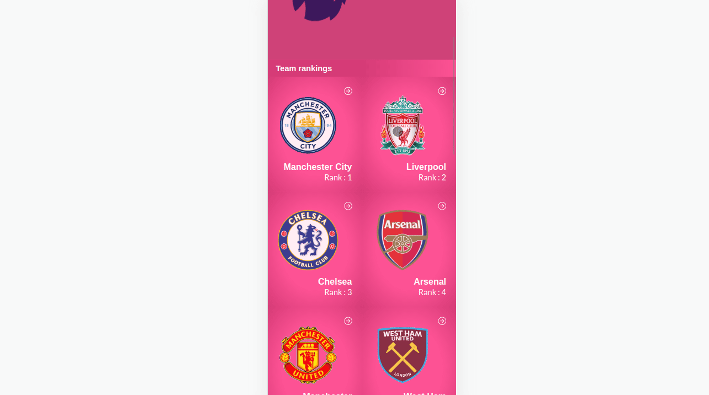

<!-- @format -->

# Football Fallback

>  "Football Fallback" is a web application for all Premier League fans. Stay upto date with all your favourite football teams in the league, check the current standings, and see who's going to promote and who's not!

This website is for my the React-Redux Capstone at Microverse and I used the api-football API for the data.
## Built With

- HTML / CSS / JavaScript / React / Redux / JEST / React Testing Library

## Live Demo

- [Netlify](https://football-fallback.netlify.app)

## Video Demo

- [Loom](https://www.loom.com/share/2431f7f17426463cae662c357d76945c)
## Getting Started

### To launch the project locally:

#### Step 1:

- Clone this repo locally using git in the command line and the following command

  git clone https://github.com/zhadier/football-fallback
  
- Alternatively, you can just download the complete zip file and extract the folder in your directory

#### Step 2:

In the project directory, you can run:

##### `npm start`

Runs the app in the development mode.\
Open [http://localhost:3000](http://localhost:3000) to view
it in your browser.

The page will reload when you make changes.\
You may also see any lint errors in the console.

##### `npm test`

Launches the test runner in the interactive watch
mode.\
See the section about [running tests](https://facebook.github.io/create-react-app/docs/running-tests)
for more information.

##### `npm run build`

Builds the app for production to the `build` folder.\
It correctly bundles React in production mode and optimizes
the build for the best performance.

The build is minified and the filenames include the
hashes.\
Your app is ready to be deployed!

See the section about
[deployment](https://facebook.github.io/create-react-app/docs/deployment)
for more information.

##### `npm run eject`

**Note: this is a one-way operation. Once you `eject`,
you can't go back!**

If you aren't satisfied with the build tool and
configuration choices, you can `eject` at any time.
This command will remove the single build dependency
from your project.

Instead, it will copy all the configuration files and
the transitive dependencies (webpack, Babel, ESLint,
etc) right into your project so you have full control
over them. All of the commands except `eject` will
still work, but they will point to the copied scripts
so you can tweak them. At this point you're on your
own.

You don't have to ever use `eject`. The curated feature
set is suitable for small and middle deployments, and
you shouldn't feel obligated to use this feature.
However we understand that this tool wouldn't be useful
if you couldn't customize it when you are ready for it.

#### Learn More

You can learn more in the
[Create React App documentation](https://facebook.github.io/create-react-app/docs/getting-started).

To learn React, check out the
[React documentation](https://reactjs.org/).

## Authors

👤 **Zeeshan Haider**

- GitHub: [@zhadier](https://github.com/zhadier)
- LinkedIn: [Zeeshan Haider](https://www.linkedin.com/in/zhadier39/)

## 🤝 Contributing

Contributions, issues, and feature requests are welcome and highly encouraged!
We feel that your input is what helps us grow so you're always Welcome :)

Feel free to check the [issues page](../../issues/).

## Show your support

Give a ⭐️ if you like this project!
I would love to hear your thoughts and ideas 🖤

## Acknowledgments

- The webpage was based on a design by: [Nelson Sakwa](https://www.behance.net/sakwadesignstudio) (original design)

- I would also like to acknowledge a fellow developer and amazing friend [Andrés Felipe](https://github.com/JohnFTitor) for helping me mock my API for testing.

## 📝 License

This project is [MIT](./MIT.md) licensed.
